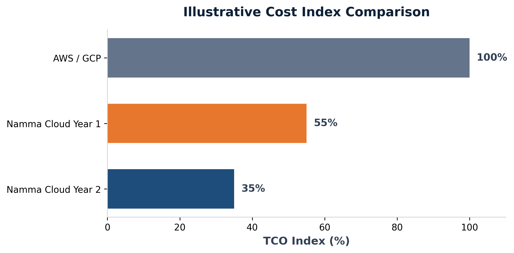

Chapter 8

# Cost Economics

The business case for Namma Cloud is not just regulatory compliance. It is a dramatically better cost structure --- with better performance, better visibility, and no FX risk.

## The Total Cost of Cloud

Most comparisons between on-premise and cloud focus on the wrong costs. The real comparison is Total Cost of Ownership (TCO) --- including compute, storage, networking, management overhead, compliance spend, FX exposure, and egress fees.

When you add up all of these, the cost of running critical banking workloads on AWS or GCP is significantly higher than the headline compute prices suggest --- and it rises every year.

### Illustrative Cost Index (Current Hyperscaler = 100)

**AWS / GCP Today Index: 100**
Baseline --- dollar-denominated, FX-exposed, compliance non-trivial

**Namma Cloud --- Year 1 Index: ~55**
~45% lower TCO from year one

**Namma Cloud --- Year 2 Index: ~35**
~65% lower TCO at steady state

*Illustrative cost index. Actual savings depend on workload profile, current infrastructure, and migration scope.*

## Where the Savings Come From

### 💱 No FX Risk

INR-denominated pricing. No exposure to dollar fluctuations. No global tariff-driven cost increases. Your infrastructure budget is predictable.

### 🗄️ Namma DB Tiering

Databases split across SSD → HDD → Tape based on access frequency. Storage costs drop 60--80% versus managed cloud databases without any performance impact on hot data.

### 🔍 Styrofoam Savings

Daily wastage detection and ML-based right-sizing recommendations reduce infrastructure spend by 20--40%. Most banks provision for peak and forget.

### 📦 Included Services

Monitoring, CI/CD, secrets management, networking, load balancing --- all included. No per-feature surcharges. No egress fees between zones.

## Namma DB Tiering: The Storage Revolution

One of the largest and most overlooked costs in banking infrastructure is database storage. Most banks have vast amounts of historical transaction data that is almost never accessed --- but they pay SSD prices to store it, because their database doesn\'t have a cheaper tier.

Namma DB splits data across three storage tiers based on access patterns:

    Hot Tier  (NVMe SSD)  — Last 30 days of transaction data
                            UPI/card real-time processing
                            <1ms read latency

    Warm Tier (SATA HDD)  — 30 days to 7 years of data
                            Regulatory reporting, audit queries
                            ~10ms read latency

    Cold Tier (Tape/S3)  — 7+ years of archived data
                            Legal hold, SEBI/RBI archive requirements
                            Seconds retrieval, 1/20th the cost

💡 The Economics

A bank storing 100TB of historical transaction data on managed RDS today pays approximately ₹2--3 Cr/month. The same data on Namma DB tiering costs ₹25--40L/month --- a 75--85% reduction --- with identical compliance and retrieval SLAs.
